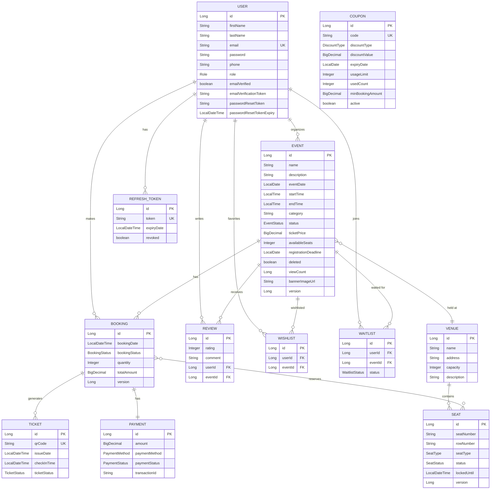

# 🎫 Event Booking System

A production-grade **Event Ticket Booking System** built with **Spring Boot 3.x** and **Java 17**, featuring real-time WebSocket updates, advanced analytics, coupon management, waitlist auto-promotion, and comprehensive admin dashboards.

[](https://openjdk.org/)
[](https://spring.io/projects/spring-boot)
[](https://www.postgresql.org/)
[](https://redis.io/)
[](LICENSE)

---

## 📋 Table of Contents

- [Tech Stack](#-tech-stack)
- [Architecture Overview](#-architecture-overview)
- [Features](#-features)
- [Getting Started](#-getting-started)
- [API Reference](#-api-reference)
- [ER Diagram](#-er-diagram)
- [Configuration](#%EF%B8%8F-configuration)
- [Testing](#-testing)
- [Project Structure](#-project-structure)

---

## 🛠 Tech Stack

| Layer               | Technology                                         |
|---------------------|---------------------------------------------------|
| **Framework**       | Spring Boot 3.4.1                                 |
| **Language**        | Java 17                                            |
| **Database**        | PostgreSQL 16                                      |
| **ORM**             | Spring Data JPA / Hibernate                        |
| **Caching**         | Redis + Spring Cache (`@Cacheable`, `@CacheEvict`) |
| **Security**        | Spring Security + JWT (Access + Refresh Tokens)    |
| **Real-Time**       | WebSocket / STOMP / SockJS                         |
| **API Docs**        | SpringDoc OpenAPI 2.7 (Swagger UI)                 |
| **QR Codes**        | ZXing 3.5.3                                        |
| **PDF Generation**  | iText 8                                            |
| **Email**           | Spring Mail (SMTP) + Async + Retry                 |
| **Rate Limiting**   | Bucket4j                                           |
| **Monitoring**      | Spring Boot Actuator                               |
| **Build Tool**      | Maven 3.9+                                         |

---

## 🏗 Architecture Overview

```
┌─────────────────────────────────────────────────────────────────┐
│                        CLIENT LAYER                             │
│   Browser / Mobile / Postman / SockJS WebSocket Client          │
└──────────────────────────────┬──────────────────────────────────┘
                               │
┌──────────────────────────────▼──────────────────────────────────┐
│                     SECURITY FILTERS                            │
│  RateLimitingFilter → JwtAuthenticationFilter → SecurityConfig  │
│  RequestLoggingFilter (Audit Logging)                           │
└──────────────────────────────┬──────────────────────────────────┘
                               │
┌──────────────────────────────▼──────────────────────────────────┐
│                    CONTROLLER LAYER (REST)                       │
│  AuthController · EventController · BookingController           │
│  TicketController · SeatController · VenueController            │
│  UserController · AdminController · PaymentController           │
│  ReviewController · WishlistController · CouponController       │
│  WaitlistController · CheckInController · ImageController       │
│  CalendarController                                             │
└──────────────────────────────┬──────────────────────────────────┘
                               │
┌──────────────────────────────▼──────────────────────────────────┐
│                     SERVICE LAYER                                │
│  EventService · BookingService · TicketService · SeatService    │
│  UserService · AdminService · PaymentService · AuthService      │
│  ReviewService · WishlistService · CouponService                │
│  WaitlistService · CalendarService · ImageStorageService        │
│  QrCodeService · EmailServiceImpl (Async + Retryable)           │
└──────────────────────────────┬──────────────────────────────────┘
                               │
┌──────────────────────────────▼──────────────────────────────────┐
│                   REPOSITORY LAYER (JPA)                         │
│  EventRepository · BookingRepository · TicketRepository         │
│  SeatRepository · UserRepository · VenueRepository              │
│  ReviewRepository · WishlistRepository · CouponRepository       │
│  WaitlistRepository · PaymentRepository · RefreshTokenRepository│
└──────────────────────────────┬──────────────────────────────────┘
                               │
┌──────────────────────────────▼──────────────────────────────────┐
│               INFRASTRUCTURE / CROSS-CUTTING                     │
│  Redis Cache · WebSocket (STOMP) · AuditLogger · Schedulers     │
│  EventSpecification (JPA Criteria) · Mapper Layer               │
└─────────────────────────────────────────────────────────────────┘
```

---

## ✨ Features

### 🔐 Authentication & Security
- **JWT-based stateless authentication** with access + refresh token rotation
- **Email verification** on registration (activation gate)
- **Forgot / Reset password** flow with time-limited tokens
- **Role-based access control** — `ADMIN`, `ORGANIZER`, `CUSTOMER`
- **Configurable CORS** with environment variable support
- **Rate limiting** (Bucket4j) on auth, booking, and payment endpoints → `HTTP 429`
- **Request logging** filter for structured audit trails

### 📅 Event Management
- Full CRUD with **soft delete** (logical deletion)
- **Organizer mapping** per event (`@ManyToOne`)
- **EventStatus lifecycle**: `DRAFT` → `PUBLISHED` → `COMPLETED` / `CANCELLED`
- **Publish / Unpublish** endpoints (`PATCH`)
- **Registration deadline** enforcement
- **Dynamic search & filtering** — category, date range, venue, city, keyword, price range (JPA Specification)
- **Paginated & sortable** responses
- **View count tracking** with automatic increment
- **Banner image URL** support

### 🎟 Booking & Payments
- **Transactional booking** with optimistic locking (`@Version`)
- **Specific seat allocation** with double-booking prevention
- **Automatic seat lock expiry** (scheduled task every 60s)
- **Coupon / promo code** discount application during booking
- **Booking cancellation** with seat release + waitlist auto-promotion
- **Real-time seat updates** via WebSocket (STOMP/SockJS)
- Payment recording with multiple payment methods

### 🎫 Tickets & Check-In
- **UUID-based ticket codes** with QR generation (ZXing)
- **PDF ticket download** with event details + embedded QR code (iText 8)
- **Ticket validation** API (by QR code or ticket ID)
- **Dedicated check-in** system (`POST /api/checkin/{ticketId}`)
- **Duplicate check-in prevention** (rejects already-used tickets)
- **Check-in timestamp** tracking

### ⭐ Reviews & Ratings
- **Post-event reviews** with 1–5 star ratings and comments
- **Attendee-only restriction** — only users with confirmed bookings can review
- **Duplicate review prevention** — one review per user per event
- **Average rating** and review count aggregation
- **Paginated review listings** per event
- **Edit / Delete** own reviews (or admin override)

### ❤️ Wishlist / Favorites
- **Add / Remove** events to personal wishlist
- **View wishlist** with full event details
- **Duplicate prevention** — silent no-op on re-add

### 🏷 Coupons & Promo Codes
- **Three discount types**: `PERCENTAGE`, `FIXED`, `EARLY_BIRD`
- **Validation rules**: expiry date, usage limits, minimum booking amount, active flag
- **Early bird logic**: full discount if booking > 7 days before event, half otherwise
- **Discount capped** at original booking amount
- **Usage tracking** with automatic increment on apply
- **Admin-only coupon creation** and listing

### 📋 Waitlist & Auto-Promotion
- **Join / Leave waitlist** per event
- **FIFO auto-promotion** — when a booking is cancelled, the first waiting user is automatically notified
- **Email notification** on promotion
- **Status tracking**: `WAITING` → `NOTIFIED` → `PROMOTED` / `CANCELLED`
- **Waitlist count** API

### 📊 Analytics & Admin Dashboard
- **Event analytics**: view count, booking count, revenue, occupancy %, average rating
- **Popular events** — sorted by view count
- **Trending events** — sorted by recent booking velocity
- **Personalized recommendations** — based on user's past booking categories
- **Admin dashboard**: total users, events, bookings, revenue, popular events
- **Revenue analytics**: total, daily, monthly, by category, daily trend
- **Booking analytics**: total, confirmed, cancelled, cancellation rate
- **User statistics**: total, verified/unverified, by role
- **Event statistics**: total, published, draft, upcoming, cancelled, by category
- **Full report** aggregation endpoint

### 📧 Email Notifications
- **Async email sending** (`@Async`) — non-blocking
- **Retry with backoff** (`@Retryable`, 3 attempts, 2s delay)
- **HTML email templates** for:
  - Booking confirmation
  - Booking cancellation
  - Event reminder (1 day before, scheduled at 8 AM daily)
  - Password reset
  - Email verification
  - Waitlist promotion
  - Coupon notification

### 🖼 Image Storage
- **File upload** API with UUID-based naming
- **Image serving** and **deletion** endpoints
- **Configurable upload directory** (`app.upload.dir`)
- **Banner image** support on Event entity

### 📆 Calendar Integration
- **iCalendar (.ics)** file download — RFC 5545 compliant
- **Google Calendar link** generation
- Includes event name, date, time, venue, and description

### ⚡ Real-Time Updates (WebSocket)
- **STOMP over SockJS** — `/ws` endpoint
- **Topic-based broadcasting** — `/topic/events/{eventId}/seats`
- **Seat status updates** pushed on booking/cancellation
- Available seats counter in real-time

### 🔍 Advanced Search
- **JPA Specification** based dynamic filtering
- Filter by: category, date range, venue, **city**, keyword, price range
- Keyword search across event name, description, and venue name
- Published-events-only for public listings

### 🏥 Monitoring & Operations
- **Spring Boot Actuator**: `/actuator/health`, `/actuator/info`, `/actuator/metrics`
- **Redis caching** with JSON serialization and configurable fallback
- **Structured audit logging** via `AuditLogger`
- **Request logging** filter with method, URI, status, and timing

### 🗄 Database & Performance
- **JPA auditing** — `createdAt`, `updatedAt`, `createdBy`, `updatedBy` on all entities
- **Database indexes** on frequently queried columns
- **Lazy loading** on all entity relationships
- **`@EntityGraph`** and **`JOIN FETCH`** for N+1 prevention
- **Optimistic locking** on Event and Seat entities

---

## 🚀 Getting Started

### Prerequisites
- Java 17+
- PostgreSQL 14+
- Redis 7+ (for caching — falls back to in-memory without it)
- Maven 3.9+

### Setup

1. **Clone the repository:**
   ```bash
   git clone <repo-url>
   cd event-booking-system
   ```

2. **Create the PostgreSQL database:**
   ```sql
   CREATE DATABASE event_booking_db;
   ```

3. **Configure environment variables** (or use defaults in `application.properties`):
   ```bash
   export DB_URL=jdbc:postgresql://localhost:5432/event_booking_db
   export DB_USERNAME=postgres
   export DB_PASSWORD=your_password
   export JWT_SECRET=your_base64_encoded_secret
   export MAIL_HOST=smtp.gmail.com
   export MAIL_USERNAME=your_email@gmail.com
   export MAIL_PASSWORD=your_app_password
   export REDIS_HOST=localhost
   export REDIS_PORT=6379
   ```

4. **Run the application:**
   ```bash
   ./mvnw spring-boot:run
   ```

5. **Access Swagger UI:**
   ```
   http://localhost:8080/swagger-ui.html
   ```

6. **WebSocket endpoint:**
   ```
   ws://localhost:8080/ws (STOMP/SockJS)
   Subscribe to: /topic/events/{eventId}/seats
   ```

---

## 📚 API Reference

### Auth (`/api/auth`)
| Method | Endpoint                    | Description              | Access  |
|--------|-----------------------------|--------------------------|---------| 
| POST   | `/api/auth/register`        | Register new user        | Public  |
| POST   | `/api/auth/login`           | Login                    | Public  |
| POST   | `/api/auth/refresh`         | Refresh access token     | Public  |
| POST   | `/api/auth/logout`          | Logout (revoke tokens)   | Public  |
| POST   | `/api/auth/forgot-password` | Request password reset   | Public  |
| POST   | `/api/auth/reset-password`  | Reset password           | Public  |
| GET    | `/api/auth/verify-email`    | Verify email             | Public  |

### Events (`/api/events`)
| Method | Endpoint                            | Description                  | Access          |
|--------|-------------------------------------|------------------------------|-----------------| 
| GET    | `/api/events`                       | List events (paginated)      | Public          |
| GET    | `/api/events/search`                | Search/filter events         | Public          |
| GET    | `/api/events/{id}`                  | Get event by ID (+ view count) | Public        |
| GET    | `/api/events/{id}/analytics`        | Event analytics              | ADMIN, ORGANIZER|
| GET    | `/api/events/popular`               | Popular events by views      | Public          |
| GET    | `/api/events/trending`              | Trending events by bookings  | Public          |
| GET    | `/api/events/recommendations`       | Personalized recommendations | Authenticated   |
| GET    | `/api/events/venue/{venueId}`       | Events by venue              | Public          |
| POST   | `/api/events`                       | Create event                 | ADMIN, ORGANIZER|
| PUT    | `/api/events/{id}`                  | Update event                 | ADMIN, ORGANIZER|
| DELETE | `/api/events/{id}`                  | Soft delete event            | ADMIN, ORGANIZER|
| PATCH  | `/api/events/{id}/publish`          | Publish event                | ADMIN, ORGANIZER|
| PATCH  | `/api/events/{id}/unpublish`        | Unpublish event              | ADMIN, ORGANIZER|

### Event Reviews (`/api/events/{eventId}/reviews`)
| Method | Endpoint                          | Description              | Access        |
|--------|-----------------------------------|--------------------------|---------------| 
| POST   | `/api/events/{eventId}/reviews`   | Add review               | Authenticated |
| GET    | `/api/events/{eventId}/reviews`   | Get reviews (paginated)  | Public        |
| PUT    | `/api/reviews/{reviewId}`         | Edit own review          | Authenticated |
| DELETE | `/api/reviews/{reviewId}`         | Delete own review        | Authenticated |

### Calendar (`/api/events/{id}`)
| Method | Endpoint                              | Description              | Access  |
|--------|---------------------------------------|--------------------------|---------|
| GET    | `/api/events/{id}/calendar.ics`       | Download .ics file       | Public  |
| GET    | `/api/events/{id}/google-calendar-link` | Get Google Calendar URL | Public  |

### Bookings (`/api/bookings`)
| Method | Endpoint                        | Description          | Access          |
|--------|---------------------------------|----------------------|-----------------| 
| POST   | `/api/bookings`                 | Create booking       | ADMIN, CUSTOMER |
| GET    | `/api/bookings`                 | List all bookings    | Authenticated   |
| GET    | `/api/bookings/{id}`            | Get booking by ID    | Authenticated   |
| GET    | `/api/bookings/user/{userId}`   | Get user bookings    | Authenticated   |
| PATCH  | `/api/bookings/{id}/cancel`     | Cancel booking       | ADMIN, CUSTOMER |

### Tickets (`/api/tickets`)
| Method | Endpoint                        | Description          | Access          |
|--------|---------------------------------|----------------------|-----------------| 
| POST   | `/api/tickets/booking/{id}`     | Generate tickets     | ADMIN, CUSTOMER |
| GET    | `/api/tickets/booking/{id}`     | Get booking tickets  | Authenticated   |
| GET    | `/api/tickets/{id}`             | Get ticket by ID     | Authenticated   |
| GET    | `/api/tickets/{id}/qrcode`      | Download QR code     | Authenticated   |
| GET    | `/api/tickets/{id}/pdf`         | Download PDF ticket  | ADMIN, CUSTOMER |
| GET    | `/api/tickets/validate/{code}`  | Validate ticket      | ADMIN, ORGANIZER|
| POST   | `/api/tickets/checkin/{code}`   | Check-in by QR code  | ADMIN, ORGANIZER|

### Check-In (`/api/checkin`)
| Method | Endpoint                        | Description            | Access          |
|--------|---------------------------------|------------------------|-----------------| 
| POST   | `/api/checkin/{ticketId}`       | Check-in by ticket ID  | ADMIN, ORGANIZER|
| GET    | `/api/checkin/validate/{ticketId}` | Validate by ticket ID | ADMIN, ORGANIZER|

### Venues (`/api/venues`)
| Method | Endpoint              | Description        | Access          |
|--------|-----------------------|--------------------|-----------------| 
| GET    | `/api/venues`         | List all venues    | Public          |
| GET    | `/api/venues/{id}`    | Get venue by ID    | Public          |
| POST   | `/api/venues`         | Create venue       | ADMIN, ORGANIZER|
| PUT    | `/api/venues/{id}`    | Update venue       | ADMIN, ORGANIZER|
| DELETE | `/api/venues/{id}`    | Delete venue       | ADMIN, ORGANIZER|

### Seats (`/api/seats`)
| Method | Endpoint                          | Description        | Access          |
|--------|-----------------------------------|--------------------|-----------------|
| GET    | `/api/seats/venue/{venueId}`      | List venue seats   | Public          |
| GET    | `/api/seats/event/{eventId}`      | List event seats   | Public          |
| POST   | `/api/seats`                      | Create seat        | ADMIN, ORGANIZER|
| PUT    | `/api/seats/{id}`                 | Update seat        | ADMIN, ORGANIZER|
| POST   | `/api/seats/{id}/lock`            | Lock seat          | Authenticated   |
| POST   | `/api/seats/{id}/unlock`          | Unlock seat        | Authenticated   |
| DELETE | `/api/seats/{id}`                 | Delete seat        | ADMIN, ORGANIZER|

### Payments (`/api/payments`)
| Method | Endpoint                        | Description        | Access          |
|--------|---------------------------------|--------------------|-----------------| 
| POST   | `/api/payments`                 | Create payment     | ADMIN, CUSTOMER |
| GET    | `/api/payments/{id}`            | Get payment        | Authenticated   |
| GET    | `/api/payments/booking/{id}`    | Get by booking     | Authenticated   |

### Wishlist (`/api/wishlist`)
| Method | Endpoint                   | Description              | Access        |
|--------|----------------------------|--------------------------|---------------|
| POST   | `/api/wishlist/{eventId}`  | Add to wishlist          | Authenticated |
| DELETE | `/api/wishlist/{eventId}`  | Remove from wishlist     | Authenticated |
| GET    | `/api/wishlist`            | Get user wishlist        | Authenticated |

### Coupons (`/api/coupons`)
| Method | Endpoint                   | Description              | Access        |
|--------|----------------------------|--------------------------|---------------|
| POST   | `/api/coupons`             | Create coupon            | ADMIN         |
| POST   | `/api/coupons/validate`    | Validate coupon          | Authenticated |
| GET    | `/api/coupons`             | List all coupons         | ADMIN         |

### Waitlist (`/api/waitlist`)
| Method | Endpoint                         | Description              | Access        |
|--------|----------------------------------|--------------------------|---------------|
| POST   | `/api/waitlist/{eventId}`        | Join waitlist            | Authenticated |
| DELETE | `/api/waitlist/{eventId}`        | Leave waitlist           | Authenticated |
| GET    | `/api/waitlist/{eventId}/count`  | Get waitlist count       | Public        |

### Images (`/api/images`)
| Method | Endpoint                   | Description              | Access          |
|--------|----------------------------|--------------------------|-----------------|
| POST   | `/api/images/upload`       | Upload image             | ADMIN, ORGANIZER|
| GET    | `/api/images/{filename}`   | Get image                | Public          |
| DELETE | `/api/images/{filename}`   | Delete image             | ADMIN, ORGANIZER|

### User Profile (`/api/users`)
| Method | Endpoint             | Description              | Access        |
|--------|----------------------|--------------------------|---------------|
| GET    | `/api/users/me`      | Get own profile          | Authenticated |
| PUT    | `/api/users/me`      | Update own profile       | Authenticated |
| GET    | `/api/users`         | List all users           | ADMIN         |
| GET    | `/api/users/{id}`    | Get user by ID           | ADMIN         |

### Admin (`/api/admin`)
| Method | Endpoint                    | Description                  | Access |
|--------|-----------------------------|------------------------------|--------|
| GET    | `/api/admin/dashboard`      | Dashboard metrics            | ADMIN  |
| GET    | `/api/admin/revenue`        | Revenue analytics            | ADMIN  |
| GET    | `/api/admin/bookings`       | Booking analytics            | ADMIN  |
| GET    | `/api/admin/users`          | User statistics              | ADMIN  |
| GET    | `/api/admin/events`         | Event statistics             | ADMIN  |
| GET    | `/api/admin/reports`        | Full aggregated report       | ADMIN  |

### Actuator
| Method | Endpoint              | Description              | Access |
|--------|-----------------------|--------------------------|--------|
| GET    | `/actuator/health`    | Health check             | Public |
| GET    | `/actuator/info`      | App info                 | Public |
| GET    | `/actuator/metrics`   | Metrics                  | ADMIN  |

---

## 📐 ER Diagram



---

## ⚙️ Configuration

All sensitive configuration is externalized via environment variables:

| Variable                 | Default                                     | Description                |
|--------------------------|---------------------------------------------|----------------------------|
| `DB_URL`                 | `jdbc:postgresql://localhost:5432/event_booking_db` | Database URL        |
| `DB_USERNAME`            | `postgres`                                  | Database username          |
| `DB_PASSWORD`            | `kritagya`                                  | Database password          |
| `JWT_SECRET`             | *(base64 encoded default)*                  | JWT signing secret         |
| `JWT_EXPIRATION`         | `86400000` (24h)                            | Access token TTL (ms)      |
| `JWT_REFRESH_EXPIRATION` | `604800000` (7d)                            | Refresh token TTL (ms)     |
| `MAIL_HOST`              | `smtp.gmail.com`                            | SMTP mail host             |
| `MAIL_PORT`              | `587`                                       | SMTP port                  |
| `MAIL_USERNAME`          | `noreply@eventbookingsystem.com`            | SMTP username              |
| `MAIL_PASSWORD`          | *(empty)*                                   | SMTP password              |
| `REDIS_HOST`             | `localhost`                                 | Redis host                 |
| `REDIS_PORT`             | `6379`                                      | Redis port                 |
| `CACHE_TYPE`             | `redis`                                     | Cache provider             |
| `CORS_ALLOWED_ORIGINS`   | `http://localhost:3000,http://localhost:5173`| Allowed CORS origins       |
| `SEAT_LOCK_TIMEOUT`      | `10`                                        | Seat lock timeout (min)    |
| `APP_BASE_URL`           | `http://localhost:8080`                     | Base URL for email links   |

---

## 🧪 Testing

```bash
# Run all tests
./mvnw clean test

# Run with verbose output
./mvnw clean test -X

# Compile only (no tests)
./mvnw clean compile
```

**Test Summary (33 tests):**

| Test Class              | Tests | Description                                     |
|-------------------------|-------|-------------------------------------------------|
| `AdminControllerTest`   | 3     | Dashboard, revenue, and booking analytics APIs   |
| `AuthControllerTest`    | 3     | Register, login, and token refresh               |
| `EventControllerTest`   | 3     | CRUD, pagination, and search                     |
| `BookingRepositoryTest` | 1     | Custom query verification                        |
| `EventRepositoryTest`   | 2     | Entity graph and specification queries           |
| `BookingServiceTest`    | 6     | Create, cancel, seat allocation, deadline check  |
| `EventServiceTest`      | 7     | CRUD, publish/unpublish, soft delete             |
| `UserServiceTest`       | 7     | Registration, profile update, role management    |

---

## 📁 Project Structure

```
src/main/java/com/kritagya/event_booking_system/
├── auth/                    # Authentication (AuthController, AuthService, DTOs)
├── config/                  # Configuration (Redis, WebSocket, OpenAPI, JPA Auditing)
├── controller/              # REST controllers (15 controllers)
├── dto/                     # Data Transfer Objects
│   └── admin/               # Admin dashboard DTOs
├── entity/                  # JPA entities (13 entities)
├── enums/                   # Enumerations (10 enums)
├── exception/               # Global exception handling
├── logging/                 # Audit logging
├── mapper/                  # Entity-DTO mappers
├── repository/              # Spring Data JPA repositories (12 repositories)
├── scheduler/               # Scheduled tasks (seat lock, event reminders)
├── security/                # Security config, JWT, rate limiting, filters
├── service/                 # Business logic services (16 services)
│   └── impl/                # Service implementations (EmailServiceImpl)
├── specification/           # JPA Specifications for dynamic queries
├── websocket/               # WebSocket publisher (SeatUpdatePublisher)
└── EventBookingSystemApplication.java
```

---

## 📄 License

This project is licensed under the [MIT License](LICENSE).
