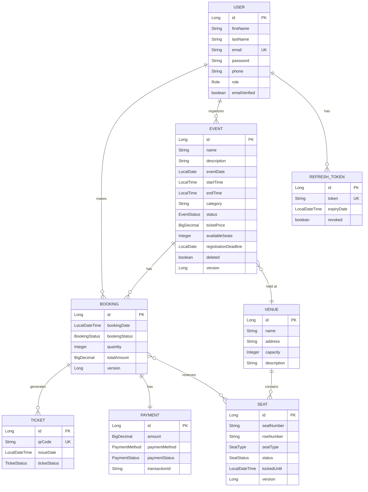

# Event Booking System

A production-grade **Event Ticket Booking System** built with **Spring Boot 3.x** and **Java 21**.

## Tech Stack

| Layer          | Technology                                   |
|----------------|----------------------------------------------|
| Framework      | Spring Boot 3.x                              |
| Language       | Java 21                                      |
| Database       | PostgreSQL                                   |
| ORM            | Spring Data JPA / Hibernate                  |
| Security       | Spring Security + JWT (Access + Refresh)     |
| Documentation  | SpringDoc OpenAPI (Swagger UI)               |
| QR Codes       | ZXing                                        |
| PDF Generation | iText 8                                      |
| Build Tool     | Maven                                        |

## Features

### Authentication & Security
- JWT-based stateless authentication (access + refresh tokens)
- Email verification on registration
- Forgot/reset password flow
- Role-based access control (ADMIN, ORGANIZER, CUSTOMER)
- Configurable CORS
- Environment variable-based configuration (no hardcoded secrets)

### Event Management
- Full CRUD with soft delete
- Organizer mapping per event
- EventStatus lifecycle: `DRAFT` → `PUBLISHED` → `COMPLETED` / `CANCELLED`
- Publish/unpublish endpoints
- Registration deadline enforcement
- Dynamic search & filtering (category, date range, venue, keyword, price range)
- Paginated & sortable responses

### Booking
- Transactional booking with optimistic locking (`@Version`)
- Specific seat allocation with double-booking prevention
- Automatic seat lock expiry (scheduled task every 60s)
- Registration deadline enforcement
- Booking cancellation with seat release

### Tickets
- UUID-based ticket codes
- QR code generation (PNG)
- PDF ticket download (event details + QR code)
- Ticket validation API
- Check-in API (marks ticket as USED)

### Database
- JPA auditing (createdAt, updatedAt, createdBy, updatedBy)
- Database indexes on frequently queried columns
- Lazy loading on all entity relationships
- Cascade rules on parent-child relationships

## Getting Started

### Prerequisites
- Java 21
- PostgreSQL
- Maven 3.9+

### Setup

1. **Clone the repository:**
   ```bash
   git clone <repo-url>
   cd event-booking-system
   ```

2. **Create the PostgreSQL database:**
   ```sql
   CREATE DATABASE event_booking_db;
   ```

3. **Configure environment variables** (or use defaults in `application.properties`):
   ```bash
   export DB_URL=jdbc:postgresql://localhost:5432/event_booking_db
   export DB_USERNAME=postgres
   export DB_PASSWORD=your_password
   export JWT_SECRET=your_base64_encoded_secret
   ```

4. **Run the application:**
   ```bash
   mvn spring-boot:run
   ```

5. **Access Swagger UI:**
   ```
   http://localhost:8080/swagger-ui.html
   ```

## API Endpoints

### Auth
| Method | Endpoint                    | Description              | Access  |
|--------|-----------------------------|--------------------------|---------|
| POST   | `/api/auth/register`        | Register new user        | Public  |
| POST   | `/api/auth/login`           | Login                    | Public  |
| POST   | `/api/auth/refresh`         | Refresh access token     | Public  |
| POST   | `/api/auth/logout`          | Logout (revoke tokens)   | Public  |
| POST   | `/api/auth/forgot-password` | Request password reset   | Public  |
| POST   | `/api/auth/reset-password`  | Reset password           | Public  |
| GET    | `/api/auth/verify-email`    | Verify email             | Public  |

### Events
| Method | Endpoint                      | Description            | Access          |
|--------|-------------------------------|------------------------|-----------------|
| GET    | `/api/events`                 | List events (paginated)| Public          |
| GET    | `/api/events/search`          | Search/filter events   | Public          |
| GET    | `/api/events/{id}`            | Get event by ID        | Public          |
| POST   | `/api/events`                 | Create event           | ADMIN, ORGANIZER|
| PUT    | `/api/events/{id}`            | Update event           | ADMIN, ORGANIZER|
| DELETE | `/api/events/{id}`            | Soft delete event      | ADMIN, ORGANIZER|
| PATCH  | `/api/events/{id}/publish`    | Publish event          | ADMIN, ORGANIZER|
| PATCH  | `/api/events/{id}/unpublish`  | Unpublish event        | ADMIN, ORGANIZER|

### Bookings
| Method | Endpoint                        | Description          | Access          |
|--------|---------------------------------|----------------------|-----------------|
| POST   | `/api/bookings`                 | Create booking       | ADMIN, CUSTOMER |
| GET    | `/api/bookings`                 | List all bookings    | Authenticated   |
| GET    | `/api/bookings/{id}`            | Get booking by ID    | Authenticated   |
| PATCH  | `/api/bookings/{id}/cancel`     | Cancel booking       | ADMIN, CUSTOMER |

### Tickets
| Method | Endpoint                        | Description          | Access          |
|--------|---------------------------------|----------------------|-----------------|
| POST   | `/api/tickets/booking/{id}`     | Generate tickets     | ADMIN, CUSTOMER |
| GET    | `/api/tickets/booking/{id}`     | Get booking tickets  | Authenticated   |
| GET    | `/api/tickets/{id}`             | Get ticket by ID     | Authenticated   |
| GET    | `/api/tickets/{id}/qrcode`      | Download QR code     | Authenticated   |
| GET    | `/api/tickets/{id}/pdf`         | Download PDF ticket  | ADMIN, CUSTOMER |
| GET    | `/api/tickets/validate/{code}`  | Validate ticket      | ADMIN, ORGANIZER|
| POST   | `/api/tickets/checkin/{code}`   | Check-in ticket      | ADMIN, ORGANIZER|

## ER Diagram



## Configuration

All sensitive configuration is externalized via environment variables:

| Variable              | Default                          | Description              |
|-----------------------|----------------------------------|--------------------------|
| `DB_URL`              | `jdbc:postgresql://...`          | Database URL             |
| `DB_USERNAME`         | `postgres`                       | Database username        |
| `DB_PASSWORD`         | `kritagya`                       | Database password        |
| `JWT_SECRET`          | (base64 encoded default)         | JWT signing secret       |
| `JWT_EXPIRATION`      | `86400000` (24h)                 | Access token TTL (ms)    |
| `JWT_REFRESH_EXPIRATION` | `604800000` (7d)              | Refresh token TTL (ms)   |
| `CORS_ALLOWED_ORIGINS`| `http://localhost:3000,...`       | Allowed CORS origins     |
| `SEAT_LOCK_TIMEOUT`   | `10`                             | Seat lock timeout (min)  |
