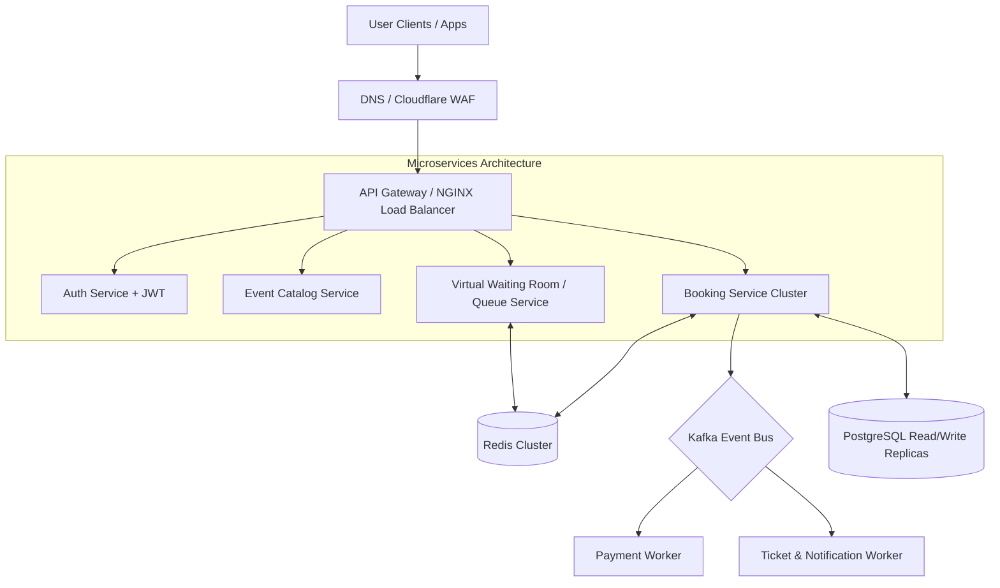

# Event Booking System — Comprehensive Interview Question & Answer Bank

> **Project Reference**: Spring Boot 3/4 | Java 17 | PostgreSQL | Spring Security | JWT | JPA / Hibernate
> **Target Roles**: Java / Spring Boot Developer, Backend Engineer, System Design Candidate

---

## Table of Contents
1. [Architecture & Design Patterns](#1-architecture--design-patterns)
2. [Spring Boot Core & Framework Mechanics](#2-spring-boot-core--framework-mechanics)
3. [Spring Security & JWT Authentication](#3-spring-security--jwt-authentication)
4. [Database Design, JPA & Hibernate](#4-database-design-jpa--hibernate)
5. [Concurrency, Locking & Race Conditions](#5-concurrency-locking--race-conditions)
6. [API Design, Validation & Error Handling](#6-api-design-validation--error-handling)
7. [Code Review, Bugs & Refactoring (Codebase Specific)](#7-code-review-bugs--refactoring-codebase-specific)
8. [System Design & High-Scalability Evolution](#8-system-design--high-scalability-evolution)
9. [Behavioral & Technical Project Defense](#9-behavioral--technical-project-defense)

---

## 1. Architecture & Design Patterns

### Q1.1: Walk me through the high-level architecture of your Event Booking System.
**Answer:**
The system is built as a monolithic RESTful web application using **Spring Boot** and **Java 17**, following a clean **Layered (Tiered) Architecture**:
- **Presentation Layer (Controllers)**: Exposes REST APIs (`/api/auth`, `/api/events`, `/api/bookings`, etc.), validates HTTP request bodies using `@Valid`, and delegates business requests to services.
- **Security Interceptor Layer**: Implements a custom `JwtAuthenticationFilter` extending `OncePerRequestFilter` to intercept requests, validate JWT tokens, load user details, and set authentication in Spring's `SecurityContextHolder`.
- **Service Layer (Business Logic)**: Encapsulates domain logic (calculating total booking amounts, checking seat availability, managing password hashing, and generating QR codes).
- **Data Access Layer (Repositories)**: Uses **Spring Data JPA** interfaces extending `JpaRepository` to perform object-relational mapping and database operations against **PostgreSQL**.
- **Cross-Cutting Concerns**: Managed via Spring AOP for global exception handling (`@ControllerAdvice`) and initialization hooks (`CommandLineRunner`).

---

### Q1.2: Why did you separate DTOs (Data Transfer Objects) from JPA Entities? Why not expose Entities directly in Controller endpoints?
**Answer:**
Separating DTOs from Entities provides several major advantages:
1. **Security & Data Hiding**: Entities like `User` contain sensitive fields like `password`. Exposing `User` directly risks leaking password hashes to clients.
2. **Preventing Circular Reference Errors**: Entities contain bidirectional JPA relationships (e.g., `Venue` has `List<Event>`, and `Event` has `Venue`). Exposing entities directly causes infinite Jackson JSON serialization loops (`StackOverflowError`).
3. **Decoupling Database Schema from API Contract**: API users should not be broken if database table columns are renamed or refactored.
4. **Tailored Request/Response Schemas**: Request DTOs (e.g., `BookingRequestDTO`) contain only client-provided inputs (`userId`, `eventId`, `quantity`), whereas Response DTOs contain calculated/flattened view attributes (`totalAmount`, `userFullName`, `eventName`).

---

### Q1.3: How are Mappers implemented in this project, and what are the trade-offs of custom static mappers vs. MapStruct?
**Answer:**
In this project, custom helper classes with static mapping methods (e.g., `BookingMapper.toDTO()`, `EventMapper.toEntity()`) are used.
- **Advantages of Custom Static Mappers**: Explicit control over transformation rules, zero external annotation processor dependencies, easy to debug line-by-line.
- **Trade-offs**: Manual code writing, risk of developer oversight when adding new fields, repetitive boilerplate code.
- **MapStruct Alternative**: MapStruct generates mapping code at compile-time using annotation processing, offering superior speed (no reflection) and eliminating boilerplate code. Converting to MapStruct would reduce maintenance overhead as the schema scales.

---

## 2. Spring Boot Core & Framework Mechanics

### Q2.1: How does Spring Boot auto-configuration work under the hood in this application?
**Answer:**
Spring Boot uses the `@SpringBootApplication` annotation on `EventBookingSystemApplication`, which combines three key annotations:
1. `@SpringBootConfiguration`: Declares the class as a source of bean definitions.
2. `@EnableAutoConfiguration`: Tells Spring Boot to scan classpath dependencies (e.g., `spring-boot-starter-data-jpa`, `spring-boot-starter-security`, `postgresql`). It reads configuration keys from `META-INF/spring/org.springframework.boot.autoconfigure.AutoConfiguration.imports` and conditionally configures beans (e.g., `DataSource`, `EntityManagerFactory`, `AuthenticationManager`) unless overridden.
3. `@ComponentScan`: Scans the `com.kritagya.event_booking_system` package and its sub-packages for `@Component`, `@Service`, `@Repository`, and `@RestController` annotated classes.

---

### Q2.2: What is `CommandLineRunner` and how is `PasswordMigrationRunner` used in this project?
**Answer:**
`CommandLineRunner` is a Spring Boot interface used to execute specific code snippets after the Spring Application Context has fully loaded but before the application starts accepting HTTP traffic.

In this codebase, `PasswordMigrationRunner` acts as an automated migration script:
- It fetches all users from `userRepository`.
- It checks if any password is stored as plain-text (i.e. does not start with BCrypt prefixes `$2a$` or `$2b$`).
- If plain-text passwords exist, it encodes them using `PasswordEncoder.encode()` and saves them back to PostgreSQL.
- It is **idempotent**, meaning it can safely run on every application restart without re-encrypting already hashed passwords.

---

### Q2.3: How does Spring perform Dependency Injection (DI) in your Service classes?
**Answer:**
The project uses **Constructor Injection** across all service components (e.g., `BookingService`, `AuthService`).
```java
@Service
public class BookingService {
    private final BookingRepository bookingRepository;
    private final UserRepository userRepository;
    private final EventRepository eventRepository;

    public BookingService(BookingRepository bookingRepository, UserRepository userRepository, EventRepository eventRepository) {
        this.bookingRepository = bookingRepository;
        this.userRepository = userRepository;
        this.eventRepository = eventRepository;
    }
}
```
**Why Constructor Injection is Best Practice**:
1. **Immutability**: Dependencies are declared `final`.
2. **Ease of Unit Testing**: Classes can be instantiated in JUnit tests without needing Spring container reflection or `@MockBean`.
3. **Prevention of NullPointerExceptions**: Ensures an object cannot be constructed in an uninitialized state.
4. **Compile-time Circular Dependency Detection**: Spring immediately detects circular reference loops during startup.

---

## 3. Spring Security & JWT Authentication

### Q3.1: Explain the step-by-step JWT authentication flow in this application.
**Answer:**
1. **Authentication Request**: The user sends credentials via `POST /api/auth/login` (`LoginRequestDTO`).
2. **Credential Verification**: `AuthService` passes credentials to Spring Security's `AuthenticationManager.authenticate(...)`.
3. **User Loading & Password Checking**: `DaoAuthenticationProvider` calls `CustomUserDetailsService.loadUserByUsername(email)` to retrieve `CustomUserDetails`. `BCryptPasswordEncoder` verifies the raw password against the hashed database password.
4. **Token Generation**: Upon successful authentication, `JwtUtil.generateToken()` constructs a signed JWT containing claims (`sub = email`, `role = ROLE_CUSTOMER`, `iat`, `exp`).
5. **Subsequent Request Authorization**: Client sends the JWT in the `Authorization: Bearer <token>` HTTP header.
6. **Filter Interception**: `JwtAuthenticationFilter` intercepts the request:
   - Extracts the token substring.
   - Validates HMAC-SHA signature key and expiration date using `JwtUtil`.
   - Loads `UserDetails` and creates a `UsernamePasswordAuthenticationToken`.
   - Stores the token in `SecurityContextHolder.getContext().setAuthentication(...)`.
7. **Role Access Control**: `SecurityConfig` checks configured HTTP matching rules (e.g., `hasAnyRole("ADMIN", "ORGANIZER")`) before allowing execution into controller methods.

---

### Q3.2: What is the difference between `hasRole()` and `hasAuthority()` in Spring Security, and how is it configured here?
**Answer:**
- `hasRole("ADMIN")` automatically prepends the prefix `ROLE_` to the string, searching for authority `ROLE_ADMIN` inside `GrantedAuthority`.
- `hasAuthority("ADMIN")` checks for the exact string `"ADMIN"` without any prefix.

In `JwtUtil.java`, the authority string stored in JWT claims is `user.getRole().name()`. In `CustomUserDetails.java`, the role is converted:
```java
new SimpleGrantedAuthority("ROLE_" + user.getRole().name())
```
Therefore, `SecurityConfig` cleanly uses `.hasRole("ADMIN")` or `.hasAnyRole("ADMIN", "ORGANIZER")`.

---

### Q3.3: How does `JwtAuthenticationEntryPoint` work when an unauthenticated user accesses a protected resource?
**Answer:**
When an unauthenticated request attempts to access an endpoint requiring authentication (e.g. `POST /api/bookings` without a token), Spring Security catches `AuthenticationException` and delegates it to `JwtAuthenticationEntryPoint.commence()`.

It returns an HTTP `401 Unauthorized` response with a JSON payload containing the timestamp, HTTP status 401, error message `"Unauthorized: Authentication token is missing or invalid"`, and the request URI path.

---

## 4. Database Design, JPA & Hibernate

### Q4.1: Explain the entity relationships between `Venue`, `Event`, `Seat`, `Booking`, `Payment`, and `Ticket`.
**Answer:**
- **`Venue` to `Event`**: One-to-Many (`@OneToMany`). A single venue hosts multiple scheduled events.
- **`Venue` to `Seat`**: One-to-Many (`@OneToMany`). A venue defines physical seat layouts.
- **`Event` to `Booking`**: One-to-Many. An event receives multiple customer bookings.
- **`User` to `Booking`**: One-to-Many. A user places multiple bookings.
- **`Booking` to `Payment`**: One-to-One (`@OneToOne`). Each booking is associated with a single payment transaction record.
- **`Booking` to `Ticket`**: One-to-Many (`@OneToMany`). A booking reserving `N` seats generates `N` individual ticket entities, each having a unique QR code.

---

### Q4.2: What is the N+1 Query Problem in JPA/Hibernate? How could it occur in this project and how do you prevent it?
**Answer:**
**The N+1 Problem**: Occurs when fetching a list of parent entities (1 query), and Hibernate subsequently executes `N` additional queries to fetch associated lazily loaded child entities for each item in the list.

**Example in this project**:
Calling `bookingRepository.findAll()` retrieves 100 bookings (1 query). When `BookingMapper.toDTO()` calls `booking.getUser().getFirstName()` and `booking.getEvent().getName()`, Hibernate fires 100 queries for users and 100 queries for events, leading to **201 queries total**!

**How to Fix**:
Use **JPQL JOIN FETCH** in repository interfaces:
```java
@Query("SELECT b FROM Booking b JOIN FETCH b.user JOIN FETCH b.event")
List<Booking> findAllWithUserAndEvent();
```
This reduces 201 database roundtrips down to **a single SQL query with JOINs**.

---

### Q4.3: Why is `spring.jpa.hibernate.ddl-auto=update` suitable for development but dangerous in production?
**Answer:**
- **Development**: `update` reads JPA `@Entity` annotations and automatically modifies database table structures, saving developer effort.
- **Production Danger**:
  1. It can lock tables unexpectedly during startup.
  2. It never drops obsolete columns or handles complex column migrations/renames, leaving orphan columns.
  3. Risk of data loss if type mappings shift.
- **Production Best Practice**: Set `ddl-auto=validate` or `none`, and manage database migrations explicitly using tools like **Flyway** or **Liquibase** with version-controlled SQL migration scripts.

---

## 5. Concurrency, Locking & Race Conditions

### Q5.1: High-Concurrency Scenario — Suppose 100 users try to book the last 2 available seats of a Coldplay concert simultaneously. What issue occurs in the current implementation?

```java
// Current Code in BookingService.java
if (event.getAvailableSeats() < request.getQuantity()) {
    throw new IllegalArgumentException("Not enough seats available");
}
event.setAvailableSeats(event.getAvailableSeats() - request.getQuantity());
eventRepository.save(event);
```

**Answer:**
This is a classic **Race Condition / Lost Update Problem**.
1. Thread A and Thread B both read `event.availableSeats = 2` simultaneously.
2. Both threads pass the validation `2 >= 2`.
3. Thread A deducts 2 seats (`availableSeats = 0`) and saves to DB.
4. Thread B also deducts 2 seats (`availableSeats = 0`) and saves to DB.
5. **Result**: Both bookings succeed, reserving 4 tickets total when only 2 were available (**Overbooking Bug**).

---

### Q5.2: How would you solve this Race Condition using Database Locking in Spring Boot?

**Answer:**

#### Solution Option A: Pessimistic Locking (DB Row Level Lock)
Acquire an exclusive `FOR UPDATE` write lock on the event row in PostgreSQL when reading it:
```java
// In EventRepository.java
@Lock(LockModeType.PESSIMISTIC_WRITE)
@Query("SELECT e FROM Event e WHERE e.id = :id")
Optional<Event> findByIdForUpdate(@Param("id") Long id);
```
*How it works*: Thread A locks the event row. Thread B must wait until Thread A finishes its transaction before reading `availableSeats`.

#### Solution Option B: Optimistic Locking (`@Version` Annotation)
Add a `@Version` field to the `Event` entity:
```java
@Version
private Integer version;
```
*How it works*: When updating `Event`, Hibernate executes:
`UPDATE event SET available_seats = 0, version = version + 1 WHERE id = 1 AND version = 5;`
If Thread B tries to save with stale version `5`, Hibernate throws an `OptimisticLockException`. We can catch this exception and retry or return a user-friendly "Seats no longer available" message.

#### Solution Option C: Atomic Database Query Update
Execute seat reduction directly in SQL:
```java
@Modifying
@Query("UPDATE Event e SET e.availableSeats = e.availableSeats - :qty WHERE e.id = :id AND e.availableSeats >= :qty")
int deductSeats(@Param("id") Long id, @Param("qty") Integer qty);
```
If `deductSeats` returns `0` updated rows, it means seats were insufficient!

---

### Q5.3: What is the role of `@Transactional` in `BookingService.java`, and what happens if a database operation fails halfway?
**Answer:**
`@Transactional` defines database transaction boundaries (`BEGIN` ... `COMMIT` / `ROLLBACK`).

**Current Risk in Codebase**:
Currently, service methods in `BookingService` lack `@Transactional` annotations!
If `eventRepository.save(event)` succeeds in deducting seats, but `bookingRepository.save(booking)` fails due to a database constraint error, the seats will remain deducted in the DB while no booking record exists (**Data Inconsistency**).

**Fix**:
Annotate mutating service methods with `@Transactional`:
```java
@Transactional
public BookingResponseDTO createBooking(BookingRequestDTO request) { ... }
```
If any RuntimeException occurs, Spring Security / JPA automatically issues a database `ROLLBACK`, reverting all changes made during that request.

---

## 6. API Design, Validation & Error Handling

### Q6.1: How does request validation work using Jakarta Validation annotations?
**Answer:**
Request DTOs are decorated with Jakarta annotations:
- `@NotNull(message = "Event ID is required")`
- `@Min(value = 1, message = "Quantity must be at least 1")`
- `@Email(message = "Invalid email format")`

In Controller parameters, `@Valid` triggers evaluation:
```java
@PostMapping
public ResponseEntity<BookingResponseDTO> createBooking(@Valid @RequestBody BookingRequestDTO request) { ... }
```
If validation fails, Spring throws `MethodArgumentNotValidException`. `GlobalExceptionHandler` intercepts this and extracts all field errors into a clean key-value map inside `ErrorResponse`.

---

### Q6.2: How does `GlobalExceptionHandler` translate Java exceptions into HTTP status codes?
**Answer:**
Using Spring's `@ControllerAdvice` and `@ExceptionHandler` annotations:
- `ResourceNotFoundException` -> HTTP 404 NOT FOUND
- `DuplicateEmailException` / `DuplicateResourceException` -> HTTP 409 CONFLICT
- `MethodArgumentNotValidException` / `IllegalArgumentException` -> HTTP 400 BAD REQUEST
- `BadCredentialsException` -> HTTP 401 UNAUTHORIZED
- `AccessDeniedException` -> HTTP 403 FORBIDDEN
- `Exception` (catch-all) -> HTTP 500 INTERNAL SERVER ERROR

---

## 7. Code Review, Bugs & Refactoring (Codebase Specific)

### Q7.1: Code Review Question — Identify 3 technical improvements or missing patterns in the current `BookingService.java` implementation.

```java
// Code snippet under review from BookingService.java
public BookingResponseDTO createBooking(BookingRequestDTO request) {
    User user = userRepository.findById(request.getUserId()).orElseThrow(...);
    Event event = eventRepository.findById(request.getEventId()).orElseThrow(...);
    if (event.getAvailableSeats() < request.getQuantity()) { throw new IllegalArgumentException(...); }
    BigDecimal totalAmount = event.getTicketPrice().multiply(BigDecimal.valueOf(request.getQuantity()));
    Booking booking = new Booking(LocalDateTime.now(), BookingStatus.CONFIRMED, request.getQuantity(), totalAmount, user, event);
    event.setAvailableSeats(event.getAvailableSeats() - request.getQuantity());
    eventRepository.save(event);
    Booking savedBooking = bookingRepository.save(booking);
    return BookingMapper.toDTO(savedBooking);
}
```

**Answer / Code Audit Findings**:
1. **Missing `@Transactional` Annotation**: The method performs multiple mutating DB updates (`eventRepository.save` and `bookingRepository.save`). Without `@Transactional`, a failure in saving the booking leaves seat updates un-rolled-back.
2. **Missing Concurrency Protection**: High concurrent booking requests will cause Lost Updates / Overbooking because seat checking and seat reduction are not atomic. (Needs Pessimistic Locking or Atomic SQL query).
3. **Hardcoded Initial Status**: `BookingStatus.CONFIRMED` is assigned prior to checking if a payment actually succeeded. A better flow is to set `BookingStatus.PENDING`, wait for payment confirmation, and then transition to `CONFIRMED`.

---

### Q7.2: Code Review Question — Look at `PaymentService.java`. How is payment processed and how should it be modified for real-world payment gateways?

```java
// Code snippet from PaymentService.java
Payment payment = new Payment(
    booking.getTotalAmount(),
    PaymentMethod.valueOf(request.getPaymentMethod()),
    PaymentStatus.COMPLETED,
    UUID.randomUUID().toString(),
    booking
);
```

**Answer**:
- **Current Limitation**: Payment creation assumes payment is instantly `COMPLETED` synchronously using a mock UUID string.
- **Production Pattern**:
  1. Integrate an external payment provider (e.g. Stripe, Razorpay, PayPal API).
  2. Create payment intent with status `PENDING` and return `client_secret` to frontend.
  3. Webhook listener endpoint (`/api/payments/webhook`) receives asynchronous event notifications from Stripe (`payment_intent.succeeded` or `payment_intent.failed`).
  4. On webhook success: Update payment status to `COMPLETED`, booking status to `CONFIRMED`, and trigger digital ticket generation asynchronously.

---

## 8. System Design & High-Scalability Evolution

### Q8.1: How would you scale this Event Booking System to handle 100,000 requests per second during a high-profile ticket sale (e.g. Taylor Swift / IPL Finals)?



**Answer Strategy**:
1. **Virtual Waiting Room / Rate Limiting**: Place a Redis-backed queue system (e.g. Cloudflare Waiting Room or custom Redis token bucket) in front of the booking API to regulate traffic flow into the system.
2. **Caching Strategy (Redis)**: Cache event details, venue layouts, and seat maps in a **Redis Cluster** to reduce database read load by 95%+.
3. **Distributed Locking (Redlock)**: Replace database pessimistic locks with **Redis Distributed Locks** (Redisson) for seat reservation keys (`lock:event:123:seat:45`).
4. **Asynchronous Processing via Kafka**: Decouple payment processing, notification sending (SMS/Email), and QR ticket generation using **Apache Kafka** topic queues.
5. **Database Sharding & Read Replicas**: Separate database reads from writes using PostgreSQL Primary/Replica replication architecture. Shard booking tables by `event_id`.

---

## 9. Behavioral & Technical Project Defense

### Q9.1: What was the most challenging technical aspect of building this system and how did you resolve it?
**Answer:**
"The most challenging technical aspect was managing domain state consistency between event seat inventories and customer bookings. 

When a user books seats, multiple entities must be updated consistently—checking availability, updating available seats, creating the booking record, and handling potential cancellations. 

I resolved this by structuring clear workflow services, enforcing strict input validation, mapping entities via dedicated DTOs to avoid circular dependencies, and implementing an exception-handling architecture using Spring's `@ControllerAdvice` to return standardized error responses across all failure modes."

---

### Q9.2: If you had 2 more weeks to work on this project, what features or improvements would you prioritize?
**Answer:**
1. **Database Locking & Transaction Fine-Tuning**: Implement `@Transactional` boundaries and pessimistic DB locking (`SELECT ... FOR UPDATE`) on event seat allocation queries to guarantee zero overbooking under high concurrency.
2. **Integration of Real Payment Gateway Webhooks**: Replace mock UUID transaction generation with Stripe/Razorpay SDK integration and asynchronous webhook listeners.
3. **Spring Doc / Swagger OpenAPI UI Integration**: Add OpenAPI 3 documentation (`springdoc-openapi-starter-webmvc-ui`) for interactive API testing.
4. **Comprehensive Automated Testing**: Add integration tests using **Testcontainers** with a real PostgreSQL container and MockMvc unit tests for service/controller layers.
5. **Caching Layer**: Integrate Spring Cache with Redis to cache popular public event queries (`GET /api/events`).
