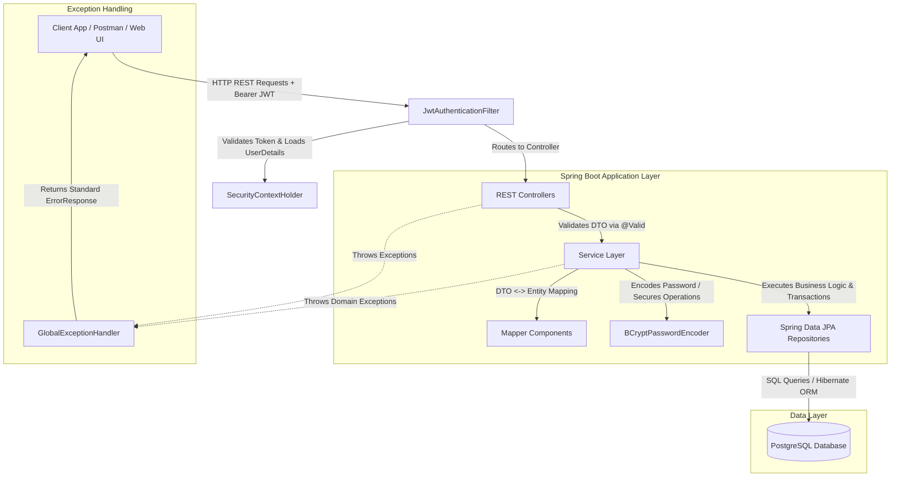
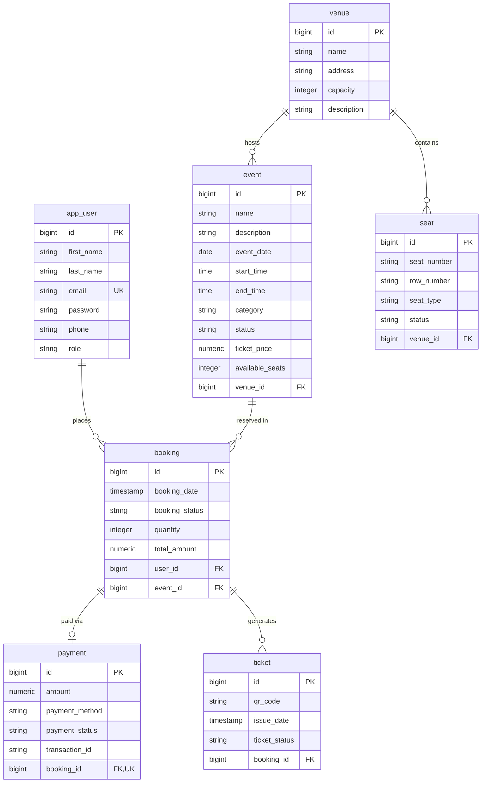
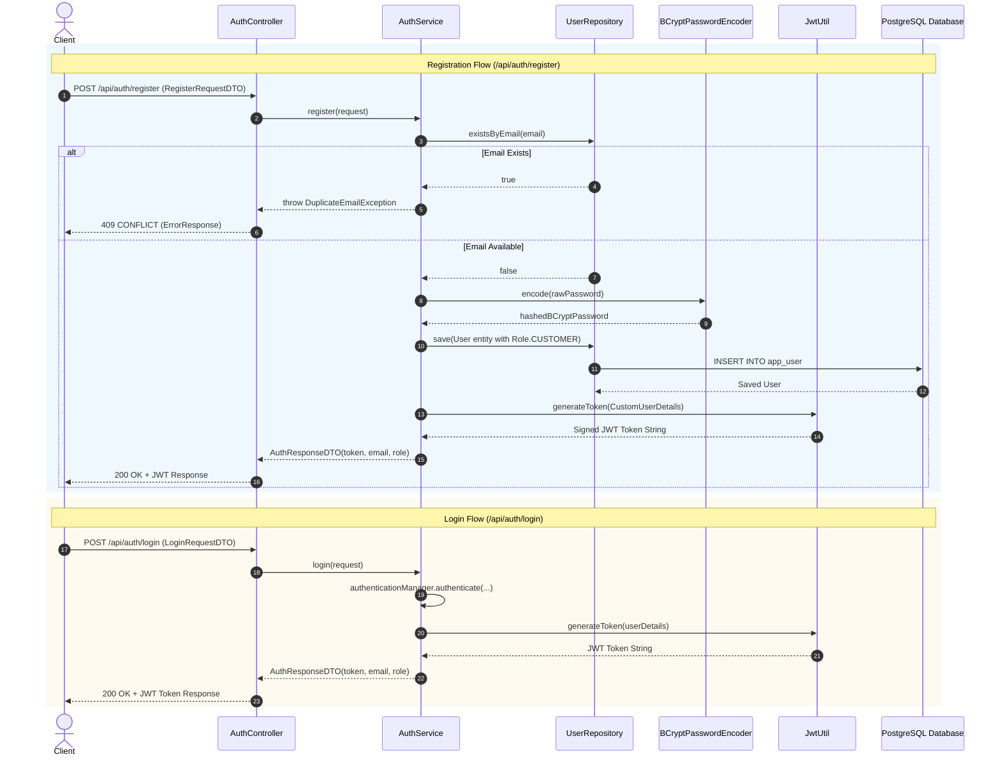
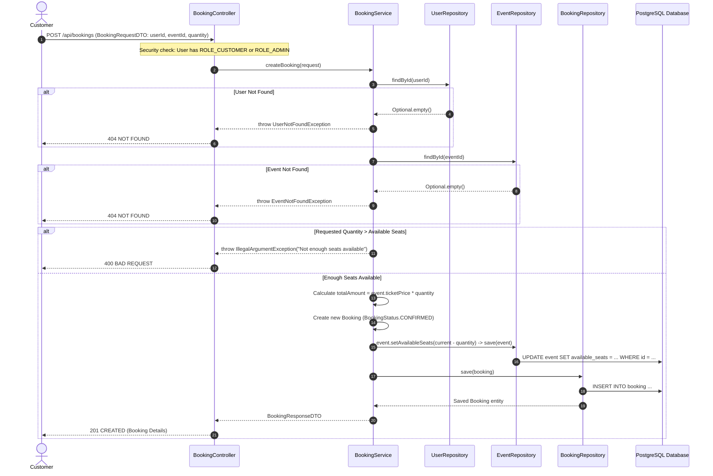
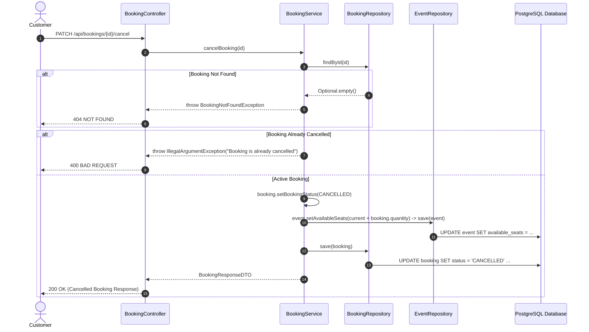
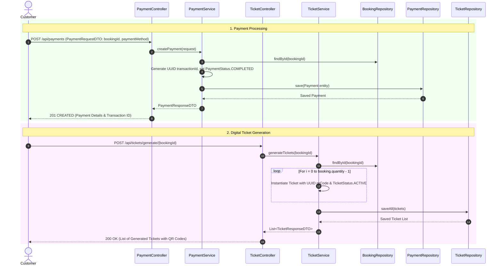
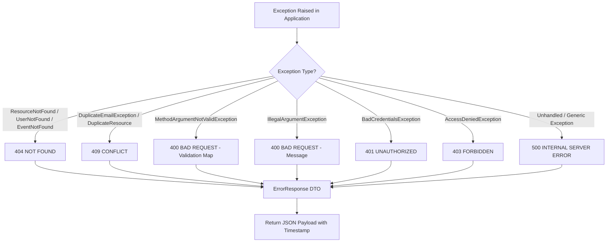

# Event Booking System — Architecture & Technical Workflow Documentation

## Executive Overview
The **Event Booking System** is an enterprise-grade backend application built with **Spring Boot 3/4** and **Java 17**, designed to handle venue management, event scheduling, seat allocations, real-time ticket reservations, payment processing, and digital QR ticket issuance. 

The architecture adheres to clean layered principles, strict separation of concerns via DTOs and Mappers, stateless **JWT-based Security** with Role-Based Access Control (RBAC), robust Exception Handling, and a PostgreSQL database layer managed through Spring Data JPA.

---

## 1. System Architecture

### 1.1 Architectural Style & High-Level Components
The system follows a classic multi-tiered layered architecture with clear boundaries:



### 1.2 Technology Stack
| Layer / Domain | Technology Choice | Description / Purpose |
| :--- | :--- | :--- |
| **Language & Runtime** | Java 17 | JDK 17 LTS syntax, records, enhanced type safety, performance |
| **Core Framework** | Spring Boot 4.1.0 (Spring Framework 6.x) | Application bootstrap, Dependency Injection, Beans management |
| **Security Framework** | Spring Security 6.x + JJWT 0.12.6 | Stateless JWT-based authentication & RBAC authorization |
| **Persistence / ORM** | Spring Data JPA / Hibernate 6.x | Entity mapping, JPA Repositories, Automatic DDL schema generation |
| **Database** | PostgreSQL | Relational storage for transactional booking integrity |
| **Validation** | Jakarta Validation (`jakarta.validation-api`) | Declarative input validation on request DTOs (`@NotNull`, `@Email`) |
| **Utility & Boilerplate** | Project Lombok | Auto-generates getters, setters, constructors |

---

## 2. Database & Domain Data Model

### 2.1 Entity Relationship Diagram (ERD)



### 2.2 Data Dictionary & Domain Entities

1. **`User` (`app_user` table)**:
   - Primary user identity storing credentials and authorization role (`ADMIN`, `ORGANIZER`, `CUSTOMER`).
   - Unique index enforced on `email`.

2. **`Venue` (`venue` table)**:
   - Represents physical or virtual locations hosting events.
   - Holds capacity constraints and maintains bidirectional `@OneToMany` relationships with `Event` and `Seat`.

3. **`Event` (`event` table)**:
   - Specific show or gathering scheduled at a venue.
   - Tracks `ticketPrice`, `availableSeats`, `eventDate`, and time windows.
   - Linked to `Venue` via `@ManyToOne` relationship.

4. **`Seat` (`seat` table)**:
   - Individual seat definitions for a venue.
   - Uses `SeatType` (`VIP`, `REGULAR`, `PREMIUM`) and `SeatStatus` (`AVAILABLE`, `BOOKED`, `RESERVED`).

5. **`Booking` (`booking` table)**:
   - Central transaction entity linking a `User` to an `Event`.
   - Tracks reserved seat `quantity`, `totalAmount`, and `bookingStatus` (`CONFIRMED`, `PENDING`, `CANCELLED`).

6. **`Payment` (`payment` table)**:
   - Financial record tied to a `Booking` via `@OneToOne`.
   - Stores `amount`, `paymentMethod` (`CREDIT_CARD`, `DEBIT_CARD`, `PAYPAL`, `UPI`), `paymentStatus` (`COMPLETED`, `PENDING`, `FAILED`, `REFUNDED`), and a unique `transactionId` UUID.

7. **`Ticket` (`ticket` table)**:
   - Digital tickets generated upon confirmed booking/payment.
   - Linked via `@ManyToOne` to `Booking`.
   - Contains a unique `qrCode` UUID for check-in verification.

---

## 3. End-to-End Core Workflows

### 3.1 Authentication & Registration Workflow



### 3.2 Booking Creation & Seat Inventory Management Workflow



### 3.3 Booking Cancellation Workflow



### 3.4 Payment Processing & Digital Ticket Issuance Workflow



---

## 4. Security Architecture & Authorization Matrix

### 4.1 Request Interception Lifecycle
Every incoming HTTP request traverses the Spring Security Filter Chain:

1. **`JwtAuthenticationFilter`**: Intercepts requests, checks for `Authorization: Bearer <token>`.
2. **`JwtUtil`**: Decodes base64 secret, validates HMAC-SHA signature, verifies token expiration date, and extracts user email subject.
3. **`CustomUserDetailsService`**: Loads user details from `UserRepository` by email.
4. **`SecurityContextHolder`**: Populates authenticated `UsernamePasswordAuthenticationToken` containing granted authorities (`ROLE_ADMIN`, `ROLE_ORGANIZER`, `ROLE_CUSTOMER`).

### 4.2 API Endpoint Security Matrix
| HTTP Method | Endpoint Pattern | Allowed Roles / Access Level | Description |
| :--- | :--- | :--- | :--- |
| `POST` | `/api/auth/register` | `PermitAll` (Public) | Customer self-registration |
| `POST` | `/api/auth/login` | `PermitAll` (Public) | Authenticate user & receive JWT |
| `GET` | `/api/events`, `/api/events/*` | `PermitAll` (Public) | Browse public event catalog |
| `GET` | `/api/venues`, `/api/venues/*` | `PermitAll` (Public) | View venue details & capacity |
| `POST`, `PUT`, `DELETE` | `/api/events/**` | `ADMIN`, `ORGANIZER` | Create, modify, cancel events |
| `POST`, `PUT`, `DELETE` | `/api/venues/**` | `ADMIN`, `ORGANIZER` | Manage venue structures |
| `POST`, `PUT`, `DELETE` | `/api/seats/**` | `ADMIN`, `ORGANIZER` | Configure venue seat maps |
| `POST` | `/api/bookings` | `ADMIN`, `CUSTOMER` | Reserve event seats |
| `PATCH` | `/api/bookings/{id}/cancel` | `ADMIN`, `CUSTOMER` | Cancel an active booking |
| `POST` | `/api/payments` | `ADMIN`, `CUSTOMER` | Make payment for booking |
| `POST` | `/api/tickets/generate/*` | `ADMIN`, `CUSTOMER` | Issue QR digital tickets |
| `ALL` | `/api/users/**` | `ADMIN` | User account administration |

---

## 5. Global Error Handling & Exception Flow



### Standardized Error Payload Structure (`ErrorResponse.java`):
```json
{
  "status": 400,
  "message": "Validation failed",
  "timestamp": "2026-07-23T18:30:00",
  "details": {
    "email": "Email must be valid",
    "quantity": "Quantity must be at least 1"
  }
}
```

---

## 6. Password Migration Mechanism

The application includes an automated data migration component (`PasswordMigrationRunner`) that implements `CommandLineRunner`:

- **Startup Execution**: Runs automatically on Spring Boot application startup.
- **Plain-text Detection**: Queries all users from `UserRepository` and checks if the stored password begins with `$2a$` or `$2b$` (BCrypt signature prefixes).
- **In-place Re-hashing**: Any plain-text legacy passwords are passed through `BCryptPasswordEncoder` and updated back into PostgreSQL.
- **Idempotency**: Already-hashed passwords are skipped cleanly, preventing double-hashing issues.

---

## 7. Operational & Deployment Architecture

### 7.1 Configuration Properties (`application.properties`)
- **Database Driver**: PostgreSQL (`org.postgresql.Driver`)
- **Database URL**: `jdbc:postgresql://localhost:5432/event_booking_db`
- **JPA / Hibernate DDL**: `update` (auto-creates/modifies relational schemas)
- **JWT Config**: HMAC-SHA secret key with 24-hour token expiration (`86400000 ms`).

### 7.2 Maven Build Strategy (`pom.xml`)
- Built with **Maven**, packaging to executable JAR.
- Includes annotation processor configurations for **Lombok** code generation.
